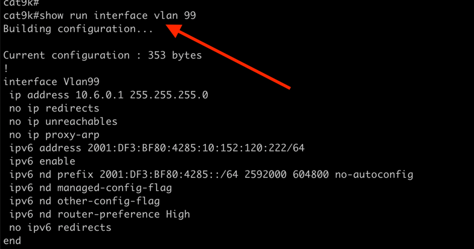

[Main Menu](../README.md)
# VLAN Configuration 


| Parameters | Mandatory/Optional |Remarks |
| ------ | ---------- |----------|
| config_type | Mandatory | Type of the configuration.For this use case, value of this parameter would be vlan_configuration |
| operation |Mandatory | Type of the operation. Vlan  configuration currently supports only create operation |
| config | Mandatory| Configuration to be used.|

## Layer2 configuration
Use the following sample ansible command to create a vlan without assigning svi
```shell
ansible-playbook cisco_ios.yml -i inventory -e \
'{
"config_type":"vlan_configuration",
"operation":"create",
"config":
         [
            {"name":"Vlan_100","vlan_id":100}
         ]
 }'
```

Use the following sample ansible command to create a vlan without assigning svi via Curl command
```shell
export var='{"extra_vars" :
"{
\"config_type\":\"vlan_configuration\",
\"operation\":\"create\",
\"config\":[{\"name\":\"Vlan_100\",\"vlan_id\":100}]}"
}'
echo $var | curl -v -k -u admin:admin -H 'content-type: application/json' -X  POST -d "$(</dev/stdin)" https://172.16.240.138/api/v2/job_templates/14/launch/ 
```


Once the playbook runs successfully, you can login to the device and run the following command to verify
```shell

show run interface vlan <vlan_id>
```



for deleting vlan
```shell
> configure terminal
> no vlan <vlan_id> 
```
